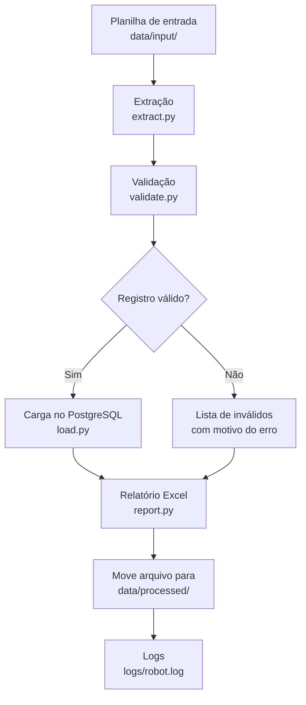

# RPA Student Data Pipeline

[](https://github.com/igcarvalho/rpa-student-data-pipeline/actions/workflows/ci.yml)

Robô de automação (RPA) que processa a planilha mensal de matrículas de alunos de uma universidade. Ele lê a planilha, valida cada registro, grava os dados válidos no PostgreSQL, gera um relatório em Excel e move o arquivo processado — tudo automaticamente, com logs e tratamento de erros.

---

## Problema de negócio

Todo mês, a secretaria recebe uma planilha (Excel/CSV) com dados de matrículas e processa tudo manualmente: confere campos, remove duplicados, corrige formatos e lança no sistema. Esse processo é repetitivo, demorado e sujeito a erros humanos.

Este robô automatiza esse fluxo de ponta a ponta.

## Fluxo do robô



## Estrutura do projeto

```
rpa-student-data-pipeline/
├── .github/workflows/ci.yml    # CI: lint + testes a cada push
├── data/
│   ├── input/                    # planilha de entrada (gerada pelo script)
│   ├── processed/                # arquivos já processados (com timestamp)
│   └── output/                   # relatórios gerados
├── logs/                         # logs da execução (robot.log)
├── scripts/
│   └── generate_sample_data.py   # gera dados fictícios com erros
├── src/rpa_students/
│   ├── main.py                   # orquestra o fluxo
│   ├── config.py                 # variáveis de ambiente e cursos permitidos
│   ├── extract.py                # leitura das planilhas (xlsx/csv)
│   ├── validate.py               # regras de validação
│   ├── load.py                   # persistência no PostgreSQL (upsert)
│   ├── report.py                 # geração do relatório Excel
│   └── logger.py                 # configuração de logs
├── tests/                        # testes unitários (pytest)
├── .env.example                  # exemplo de variáveis de ambiente
├── .gitignore
├── Dockerfile
├── docker-compose.yml
├── pyproject.toml
└── README.md
```

## Como rodar

### Opção 1 — Docker (recomendado)

Requisitos: Docker e Docker Compose.

```bash
# 1. Gere os dados de exemplo (dentro de um container Python)
docker run --rm -v $(pwd):/app -w /app python:3.12-slim bash -c \
  "pip install -e . && python scripts/generate_sample_data.py"

# 2. Suba o banco e execute o robô com um único comando
docker compose up --build
```

O robô lê `data/input/`, grava no PostgreSQL, gera o relatório em `data/output/` e move o arquivo para `data/processed/`.

### Opção 2 — Local

Requisitos: Python 3.10+ e PostgreSQL 16 rodando localmente.

```bash
# 1. Instale as dependências
pip install -e ".[dev]"

# 2. Configure as variáveis de ambiente
cp .env.example .env
# Edite o .env com as credenciais do seu banco

# 3. Gere os dados de exemplo
python scripts/generate_sample_data.py

# 4. Execute o robô
python -m rpa_students.main
```

## Gerando dados de exemplo

```bash
python scripts/generate_sample_data.py
# Saída: data/input/matriculas.xlsx (200 linhas)
```

O script gera ~200 registros 100% fictícios (Faker, locale pt_BR) com erros propositais:

| Tipo de erro | Exemplo |
|---|---|
| Campos vazios | nome, cpf ou email em branco |
| CPF inválido | `111.111.111-11` |
| E-mail mal formatado | `aluno@dominio` |
| Data inválida/futura | `31/02/2022`, `01/01/2030` |
| Curso inexistente | `Astronomia`, `Veterinária` |
| Matrícula duplicada | mesma matrícula em linhas diferentes |

## Exemplo de entrada e saída

### Entrada (amostra da planilha)

| matricula | nome | cpf | email | curso | data_ingresso |
|---|---|---|---|---|---|
| 2020498886 | Rhavi Vargas | 992.459.052-09 | vitoria40@bol.com.br | Pedagogia | 17/05/2022 |
| 2023622130 | Maria Luísa Nogueira | 351.027.996-49 | henrique38@live.com | Direito | 23/03/2022 |
| 2025899635 | João Silva | 903.584.926-00 | @dominio.com | Veterinária | 31/02/2022 |

### Saída — Relatório Excel (3 abas)

**Aba Resumo:**

| Métrica | Valor |
|---|---|
| Total de registros processados | 200 |
| Registros válidos | 112 |
| Registros inválidos | 88 |
| Percentual de sucesso | 56.0% |
| Tempo de execução (segundos) | 0.42 |

**Aba Inválidos (amostra):**

| matricula | nome | cpf | email | curso | data_ingresso | erro |
|---|---|---|---|---|---|---|
| 2025899635 | João Silva | 903.584.926-00 | @dominio.com | Veterinária | 31/02/2022 | CPF '903.584.926-00' é inválido; E-mail '@dominio.com' tem formato inválido; Data '31/02/2022' está em formato inválido; Curso 'Veterinária' não é permitido. |

### Saída — Log (logs/robot.log)

```
2026-10-01 13:25:18 | INFO    | Início da execução do robô de processamento de matrículas
2026-10-01 13:25:18 | INFO    | 200 linhas lidas da planilha.
2026-10-01 13:25:18 | INFO    | Validação concluída: 112 válidos, 88 inválidos.
2026-10-01 13:25:18 | INFO    | 112 registros gravados no banco (upsert idempotente).
2026-10-01 13:25:18 | INFO    | Relatório gerado: data/output/relatorio_20261001_132518.xlsx
2026-10-01 13:25:18 | INFO    | Arquivo movido para: data/processed/matriculas_20261001_132518.xlsx
2026-10-01 13:25:18 | INFO    | Execução concluída com sucesso!
```

## Decisões técnicas

| Decisão | Por quê |
|---|---|
| **pandas** para leitura/escrita de planilhas | Padrão de mercado, suporta xlsx e csv com uma API simples |
| **SQLAlchemy 2.x** com `DeclarativeBase` | ORM moderno, type hints nativas, evita SQL puro |
| **Upsert com `ON CONFLICT DO UPDATE`** | Idempotência no banco: rodar 2x não duplica dados |
| **Transação (`engine.begin()`)** | Commit automático se tudo der certo, rollback se falhar |
| **SQLite em memória nos testes** | Mesma interface do SQLAlchemy, sem precisar de Postgres no CI |
| **Faker com locale pt_BR** | Dados fictícios realistas em português |
| **python-dotenv** | Configuração por variáveis de ambiente, sem segredos no código |
| **Exit code 1 em falha** | Permite que orquestradores (cron, CI, Airflow) detectem falhas |
| **Cursos permitidos no `config.py`** | Lista fixa e simples; em produção viria de uma tabela |

## Como rodar os testes

```bash
# Com as dependências de desenvolvimento instaladas
pip install -e ".[dev]"

# Roda todos os testes
pytest tests/ -v

# Roda com cobertura
pytest tests/ --cov=src/rpa_students
```

Os testes cobrem:
- Cada regra de validação (CPF, e-mail, data, curso, campos obrigatórios)
- Leitura de arquivos xlsx/csv e tratamento de colunas faltantes
- Idempotência da carga no banco (rodar 2x não duplica)

## Limitações conhecidas e melhorias futuras

- **E-mail via SMTP**: não implementado. O envio do relatório por e-mail é uma melhoria futura (variáveis já previstas no `.env.example`).
- **Cursos permitidos**: lista fixa no código. Em produção, deveria vir de uma tabela no banco ou arquivo de configuração externo.
- **Agendamento**: o robô é executado manualmente ou via `docker compose up`. Em produção, seria agendado com cron, Airflow ou similar.
- **Interface web**: não há interface gráfica. O robô é 100% via linha de comando.

## Como isso se conecta a RPA

Este projeto implementa em Python o mesmo fluxo que ferramentas de RPA como **UiPath** ou **Power Automate** fariam visualmente:

| Etapa | Aqui (Python) | UiPath | Power Automate |
|---|---|---|---|
| Ler planilha | `pandas.read_excel()` | "Read Range" (Excel) | "List rows in a table" |
| Validar dados | funções em `validate.py` | "If" + "For Each" | "Condition" + "Apply to each" |
| Gravar no banco | SQLAlchemy upsert | "Insert/Update" (Database) | "Execute SQL statement" |
| Gerar relatório | `pandas.ExcelWriter` | "Write Range" (Excel) | "Create table" / "Add row" |
| Tratar erro | `try/except` + logs | "Try Catch" | "Configure run after" |
| Agendar | `docker compose up` / cron | "Triggers" | "Recurrence" |

A lógica é a mesma — o que muda é a forma de expressá-la. Em Python, temos mais flexibilidade e controle; nas ferramentas de RPA, temos uma interface visual e integrações prontas com sistemas corporativos.

## Versão UiPath

Este mesmo fluxo pode ser implementado no UiPath com as seguintes atividades:

### Fluxo principal

```
[Start]
   ↓
[Read Range] ← Lê a planilha Excel (data/input/matriculas.xlsx)
   ↓
[For Each] ← Itera cada linha da planilha
   ↓
[If] ← Valida os campos (CPF, e-mail, data, curso)
   ↓
[Insert/Update] ← Grava no PostgreSQL (upsert idempotente)
   ↓
[Write Range] ← Gera o relatório Excel (3 abas)
   ↓
[Move File] ← Move o arquivo para data/processed/
   ↓
[End]
```

### Atividades por etapa

| Etapa | Atividade UiPath | Equivalente Python | Descrição |
|---|---|---|---|
| Ler planilha | **Read Range** | `pandas.read_excel()` | Lê o Excel e devolve um DataTable |
| Iterar linhas | **For Each** | `for _, row in df.iterrows()` | Para cada linha, executa as atividades internas |
| Validar campos | **If** + **Else** | `if not validar_cpf(cpf):` | Verifica cada regra de validação |
| Gravar no banco | **Insert/Update** | SQLAlchemy upsert | Grava ou atualiza o registro no PostgreSQL |
| Gerar relatório | **Write Range** | `pandas.ExcelWriter()` | Escreve o DataTable no Excel |
| Mover arquivo | **Move File** | `shutil.move()` | Move o arquivo processado com timestamp |
| Tratar erro | **Try Catch** | `try/except` | Captura exceções e registra no log |
| Agendar | **Orchestrator** | `docker compose up` / cron | Agenda e monitora a execução |

### Validação no UiPath

No UiPath, cada regra de validação seria implementada com atividades **If** aninhadas:

```
[If] ← nome está vazio?
   ↓ Sim
[Add to List] ← Adiciona à lista de inválidos
   ↓ Não
[If] ← CPF é inválido?
   ↓ Sim
[Add to List] ← Adiciona à lista de inválidos
   ↓ Não
[If] ← E-mail é inválido?
   ↓ ...
```

### Diferenças entre Python e UiPath

| Aspecto | Python | UiPath |
|---|---|---|
| Interface | Código | Visual (blocos conectados) |
| Curva de aprendizado | Média | Baixa |
| Flexibilidade | Alta | Média |
| Integrações | Via bibliotecas | Nativas (Excel, SAP, etc.) |
| Depuração | Logs + debugger | Debugger visual + logs |
| Custo | Gratuito | Licença paga (Community Edition gratuita) |

### Por que aprender UiPath?

- É a ferramenta de RPA mais usada no mercado corporativo
- A YDUQS e outras grandes empresas utilizam UiPath
- A lógica de automação é a mesma — o que muda é a interface
- Facilita a transição para projetos reais de RPA

## Licença

Projeto de portfólio para fins educacionais. Dados 100% fictícios.
